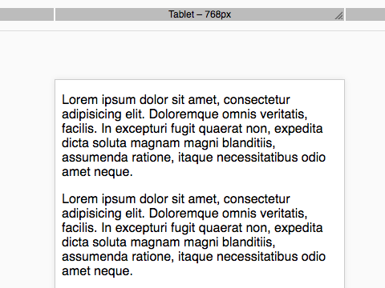

# cells-demo-resizable-viewport


[Demo of component in Cells Catalog](https://bbva-ether-cellscatalogs.appspot.com/?view=demo#/component/cells-demo-resizable-viewport)

__Example:__

```html
<cells-demo-resizable-viewport
  breakpoints='{
    "mobile": { "width": 360, "height": 640, "name": "Mobile" },
    "tablet": { "width": 768, "height": 1024, "name": "Tablet" }}'
  selected-key="tablet">
</cells-demo-resizable-viewport>
```

## Styling

The following custom properties and mixins are available for styling:

### Custom Properties
| Custom Property                                        | Selector                                        | CSS Property | Value                                                    |
| ------------------------------------------------------ | ----------------------------------------------- | ------------ | -------------------------------------------------------- |
| --cells-demo-resizable-viewport-background-color       | .bp__bar                                        | border       | `No fallback value`                                      |
| --cells-demo-resizable-viewport-dragger-inactive-color | .bp__bar .dragger-path                          | fill         |   #fff |
| --cells-demo-resizable-viewport-dragger-color          | .bp__bar.iron-selected ~ .bp__bar .dragger-path | fill         | `No fallback value`                                      |
| --cells-demo-resizable-viewport-dragger-color          | .bp__bar.iron-selected .dragger-path            | fill         | `No fallback value`                                      |
| --cells-demo-resizable-viewport-dragger-color          | .bp__bar:hover ~ .bp__bar .dragger-path         | fill         | `No fallback value`                                      |
| --cells-demo-resizable-viewport-dragger-color          | .bp__bar:hover .dragger-path                    | fill         | `No fallback value`                                      |
### @apply
| Mixins                                                      | Selector                                | Value |
| ----------------------------------------------------------- | --------------------------------------- | ----- |
| --cells-demo-resizable-viewport-bar-wrapper                 | .bp                                     | {}    |
| --cells-demo-resizable-viewport-bar                         | .bp__bar                                | {}    |
| --cells-demo-resizable-viewport-dragger                     | .bp__bar .dragger                       | {}    |
| --cells-demo-resizable-viewport-bar-selected                | .bp__bar.iron-selected                  | {}    |
| --cells-demo-resizable-viewport-bar-selected-siblings       | .bp__bar.iron-selected ~ .bp__bar       | {}    |
| --cells-demo-resizable-viewport-bar-selected-siblings-hover | .bp__bar.iron-selected ~ .bp__bar:hover | {}    |
| --cells-demo-resizable-viewport-bar-hover                   | .bp__bar:hover                          | {}    |
| --cells-demo-resizable-viewport-bar-hover-siblings          | .bp__bar:hover ~ .bp__bar               | {}    |
| --cells-demo-resizable-viewport-bar-hover-label             | .bp__bar:hover .bp__label               | {}    |
| --cells-demo-resizable-viewport-bar-hover-label-siblings    | .bp__bar:hover ~ .bp__bar .bp__label    | {}    |
| --cells-demo-resizable-viewport-bar-label                   | .bp__label                              | {}    |
| --cells-demo-resizable-viewport-bar-selected-label          | .iron-selected .bp__label               | {}    |
| --cells-demo-resizable-viewport-button-reset                | .btn-reset                              | {}    |
| --cells-demo-resizable-viewport-button-reset-active         | .btn-reset:hover                        | {}    |
| --cells-demo-resizable-viewport-button-reset-active         | .btn-reset:active                       | {}    |
| --cells-demo-resizable-viewport-button-reset-active         | .btn-reset:focus                        | {}    |
