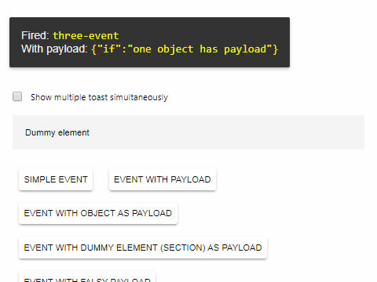

# cells-demo-event-toaster

[](https://bbva-ether-cellscatalogs.appspot.com)

[Demo of component in Cells Catalog](https://bbva-ether-cellscatalogs.appspot.com/?view=demo#/component/cells-demo-event-toaster)

`<cells-demo-event-toaster>` listens to a list of events and
opens a `paper-toast` element when those events are triggered.

In case it has a payload, it will also print it.

Example:

```html
<cells-demo-event-toaster events="[[eventsArray]]"></cells-demo-event-toaster>
```

## Styling

The following custom properties and mixins are available for styling:

### Custom Properties
| Custom Property                            | Selector       | CSS Property | Value   |
| ------------------------------------------ | -------------- | ------------ | ------- |
| --cells-demo-event-toaster-highlight-color | .highlight     | color        |  yellow |
| --cells-demo-event-toaster-vertical-top    | ]) paper-toast | margin-top   |  160px  |
### @apply
| Mixins                               | Selector   | Value |
| ------------------------------------ | ---------- | ----- |
| --cells-demo-event-toaster           | :host      | {}    |
| --cells-demo-event-toaster-highlight | .highlight | {}    |
